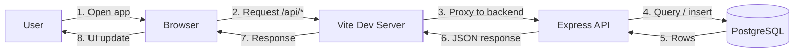

# Flourish

## App Summary

Flourish is a wellness and parenting app that helps users track their mood, keep a journal, log baby activities (feeding, naps, mood), and coordinate support with a partner. The primary user is a parent (often a new parent) who wants one place to check in emotionally, record moments, manage baby routines, and request or offer support. The product combines mood check-ins, journal prompts, affirmations, baby tracking (feeding, sleep, mood), a support widget for partner requests, and optional meditations and articles. The frontend was generated from Base44 and can run against a local Postgres-backed API so you own the data and backend.

## Tech Stack

| Layer | Technology |
|-------|------------|
| **Frontend** | React 18, Vite 6, React Router, Tailwind CSS, TanStack React Query, Framer Motion, Base44 SDK (API client) |
| **Backend** | ASP.NET Core Web API (.NET), CORS |
| **Database** | SQLite (via Entity Framework Core) |
| **Authentication** | None by default (`requires_auth: false`); API supports optional token via `Authorization` header |
| **External services** | None required; optional Base44 cloud if not using the local backend |

## Architecture Diagram



- **User** opens the app in the browser.
- **Browser** loads the React app from the **Vite** dev server and sends API requests to the same origin (`/api/...`).
- **Vite** proxies `/api` to the **ASP.NET API** (see `flourish/vite.config.js`).
- **ASP.NET API** handles base44-compatible routes and reads/writes **SQLite**.
- Responses flow back to the browser so the UI updates; data persists in the database.

## Prerequisites

Install and verify the following before setup:

| Software | Purpose | Install | Verify |
|----------|---------|---------|--------|
| **Node.js** (v18 or later) | Run frontend and backend | [nodejs.org](https://nodejs.org/) | `node -v` and `npm -v` |
| **PostgreSQL** | Database for the backend | [postgresql.org](https://www.postgresql.org/download/) | `psql -V` |
| **psql** (in PATH) | Run schema/seed or debug DB | Included with PostgreSQL | `psql --version` |

Ensure `psql` is on your system PATH so you can run `createdb` and `psql $DATABASE_URL -f seed.sql` from the project.

## Installation and Setup

1. **Clone the repository** (if not already) and go to the project root:
   ```bash
   cd Flourish-main
   ```

2. **Backend: restore/build**
  ```bash
  cd backend/flourishbackend/flourishbackend
  dotnet restore
  dotnet build
  ```

3. **Database**
  The ASP.NET backend uses SQLite and will auto-create the DB/tables on startup (see `Program.cs`).

6. **Frontend: install dependencies**
   ```bash
   cd ../flourish
   npm install
   ```

7. **Frontend: environment**
   Create or edit `flourish/.env` (or `flourish/.env.local`) with:
   ```env
  # Used by some Base44 SDK flows; API requests are proxied by Vite.
  VITE_BASE44_APP_BASE_URL=http://localhost:4000
   VITE_BASE44_APP_ID=your_app_id
   ```
  This aligns the frontend with your local ASP.NET backend (default `http://localhost:4000`).

## Running the Application

1. **Start the backend** (Terminal 1):
   ```bash
   cd backend/flourishbackend/flourishbackend
   dotnet run
   ```
   Leave it running. The API will be at `http://localhost:4000`.

2. **Start the frontend** (Terminal 2):
   ```bash
   cd flourish
   npm run dev
   ```
   Run `lsof -nP -iTCP -sTCP:LISTEN | grep -E "vite|node"` to see what port localhost is running on, then type that into your browser (e.g. `http://localhost:5173`).

The app will load and use the local backend; proxy errors in the Vite terminal should stop once the backend is running.

## Verifying the Vertical Slice

Confirm that a full flow works: UI → API → database → persistence after refresh.

1. **Trigger the feature**  
   In the app, open the Home view and use **Mood Check-In**: move the slider and click to save a mood entry.

2. **Confirm the database was updated**  
   In a new terminal:
   ```bash
   psql $DATABASE_URL -c "SELECT id, created_date, data FROM mood_entry ORDER BY created_date DESC LIMIT 3;"
   ```
   (If `DATABASE_URL` is not set, use e.g. `psql postgresql://localhost:5432/flourish -c "SELECT ..."`.)  
   You should see a new row with your `mood_value` and today’s `date` in `data`.

3. **Verify persistence**  
   Refresh the browser (F5 or Cmd+R). The mood entry should still appear (e.g. on Home or Calendar). The new row remains in the database and is loaded again by the API.

This end-to-end path (UI → Vite proxy → ASP.NET → SQLite → response → UI and refresh) confirms the vertical slice is working.
